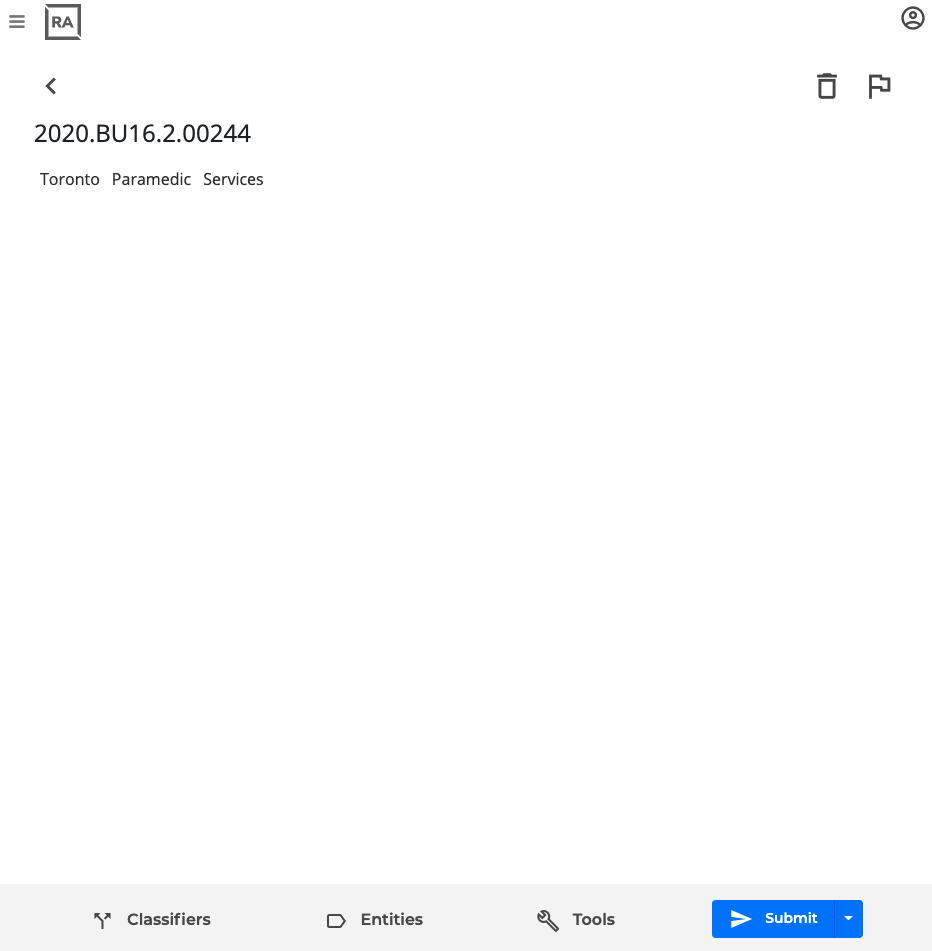
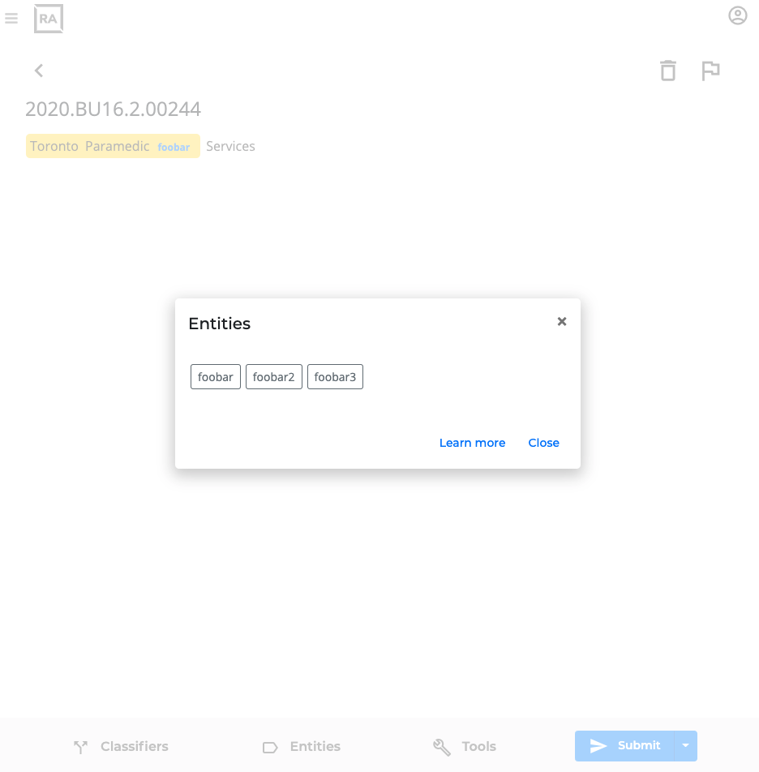
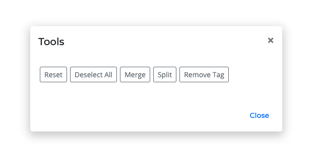
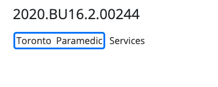
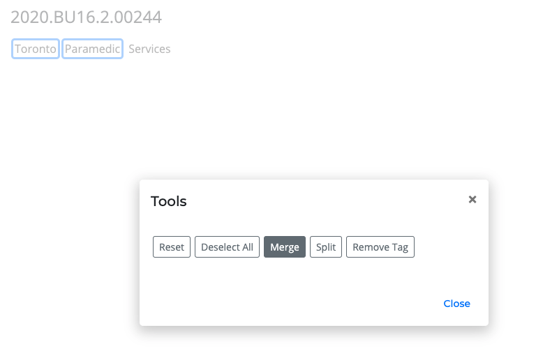
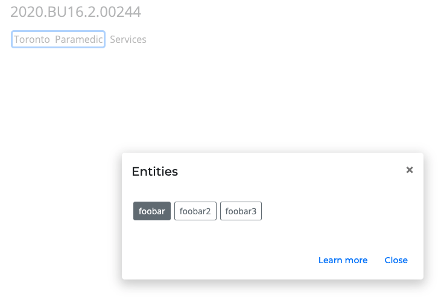
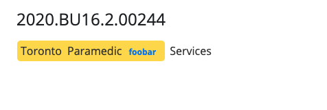
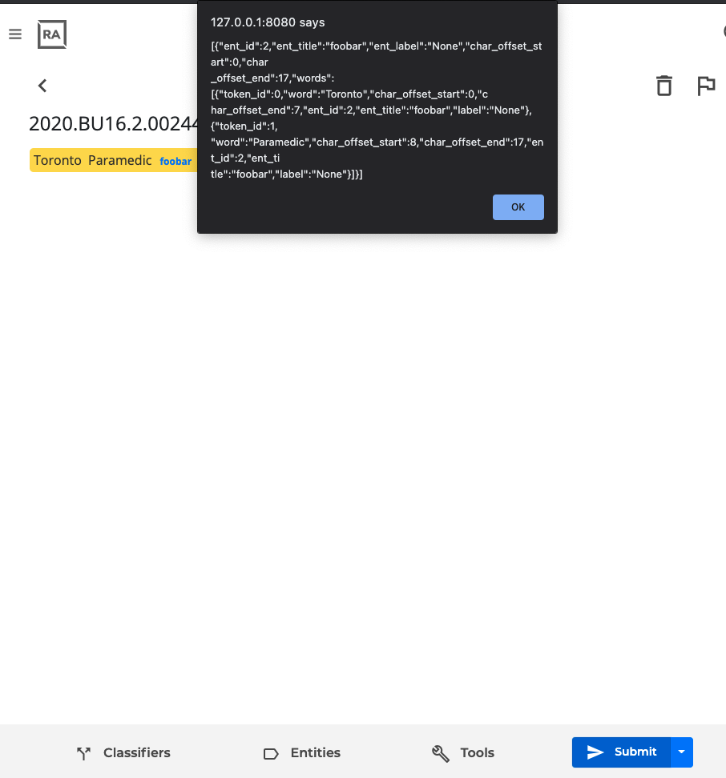

# Tagging page details

## Background

We are building a tagging studio that allows users to 'tag' words on a document.

The current version is built with python-Flask and all content on the page is rendered by Jinja within the Flask framework.

## Goal

The goal is to create a highlight-to-select (highlight-able selection of words) on a page like https://prodi.gy/demo that creates the same JSON package as the current setup, which uses tap-to-select. Tap-to-select is really only good for touch screens, not desktops. So we need to create a desktop-friendly page. The goal of this mini project is to create a highlight-to-select page to replace tap-to-select.

---

## Details

The tag page in the tagging studio is a single page that loads an article that the user uploaded. It has been parsed in the backend to render on the front with a certain set of classes and data attributes in the html tags.

A typical document looks like this:



Notice on the bottom there are 4 items:

- classifiers
- entities
- tools
- submit

### Classifiers

Ignore for now. No need to deal with this.

### Entities



In the tagging studio system, the user creates his/her own entities ahead of time. What you see on the page is stuff that has been compiled by Flask's Jinja ahead of time.

When the user clicks on the "Entities" button, a modal pops up with the options. We assume that the user has already selected text ahead of time and then clicks the Entities modal to select and tag the selected text with the entity they want.

Notice that the html for the entities menu modal looks like this:

```html
<div class="container" id="entities_menu">

  <div class="row mb-3">

    <div data-dismiss="modal" class="btn btn-outline-secondary btn-sm visible_entity" style="margin:3px !important; font-size:14px; cursor: pointer;" data-ent_id="2" data-ent_title="foobar" data-label="None">foobar</div>

    <div data-dismiss="modal" class="btn btn-outline-secondary btn-sm visible_entity" style="margin:3px !important; font-size:14px; cursor: pointer;" data-ent_id="3" data-ent_title="foobar2" data-label="None">foobar2</div>

    <div data-dismiss="modal" class="btn btn-outline-secondary btn-sm visible_entity" style="margin:3px !important; font-size:14px; cursor: pointer;" data-ent_id="4" data-ent_title="foobar3" data-label="None">foobar3</div>

  </div>

</div>
```

The important thing here is the data attribute `data-ent_id`. Everytime the user taps-to-select a word and then clicks on an entity (e.g. "foobar3"), a javascript function applies the ent_id data attribute to other parts of the DOM, as shown below. Just remember this data-ent_id attribute for now.

### Tools

This button allows the user to merge, split, or reset the entire set of words they selected. We won't need "merge" or "split" anymore after we implement highlight-to-select. So only good to know, but you don't need to touch this part.



### Submit

This simply triggers a function that packages all the edited html on the page and jsonify and submit as ajax (more details below). Again, do not touch this part.

---

## What we need you to do

What we need you to do is to first look carefully at how the entities are currently parsed and sent back to the backend via ajax.

If you look at the div tag with id = "flashcard", you'll notice a few things:

```html
<!-- Body -->
<div class="form-row">
  <div class="col-md-12 mb-3">
    <div id="flashcard" class="first_div">

      <!-- the token_group "Toronto" -->
      <div class="token_group" data-temp_span_id="" data-label="" data-label_hash="" data-ent_title="" data-ent_id="">
        <span class="word" data-token_id="0" data-word="Toronto" data-char_offset_start="0" data-char_offset_end="7">
            Toronto
        </span>
      </div>

      <!-- the token_group "Parademic" -->
      <div class="token_group" data-temp_span_id="" data-label="" data-label_hash="" data-ent_title="" data-ent_id="">
        <span class="word" data-token_id="1" data-word="Paramedic" data-char_offset_start="8" data-char_offset_end="17">
            Paramedic
        </span>
      </div>

      <!-- the token_Group "Services" -->
      <div class="token_group" data-temp_span_id="" data-label="" data-label_hash="" data-ent_title="" data-ent_id="">
        <span class="word" data-token_id="2" data-word="Services" data-char_offset_start="18" data-char_offset_end="26">
            Services
        </span>
      </div>

    </div>
  </div>
</div>
<!-- end of Body -->
```

By design, there are 2 levels of wrappers:

Level | class | Description
--- | --- | ---
1 | token_group | Can be a single word, or a group of words (if they are merged together)
2 | word | Can only be one single word

By default, the document starts with 1 `token_group` class and 1 `word` class inside it.

Each `token_group` class div tag must also have the following data attributes:
- `data-temp_span_id`
- `data-label` 
- `data-label_hash` 
- `data-ent_title` 
- `data-ent_id` 


Each `word` class div tag must also have the following data attributes:
- `data-token_id`
- `data-word`
- `data-char_offset_start`
- `data-char_offset_end`


### What if we had more than one word in a `token_group`?

Let's say the user clicks `Toronto` and `Paramedic` and merges them together.
After the user clicks Tools > Merge, etc. the DOM will look like this (below).
Note that the goal of this mini project is to NOT use merge, but simply 'merge' by highlighting across words.











```html
<div class="form-row">

  <div class="col-md-12 mb-3">

    <div id="flashcard" class="first_div">


      <!-- token_group for merged "Toronto Parademic" -->
      <div class="token_group merged_content entity tagged" data-ent_id="2" data-ent_title="foobar" data-label="None">

        <span class="word  entity" data-token_id="0" data-word="Toronto" data-char_offset_start="0" data-char_offset_end="7" data-ent_id="2" data-ent_title="foobar" data-label="None">
            Toronto
        </span>

        <span class="word  entity" data-token_id="1" data-word="Paramedic" data-char_offset_start="8" data-char_offset_end="17" data-ent_id="2" data-ent_title="foobar" data-label="None">
            Paramedic
        </span>

        <!-- this is copied from the data-ent_title from the Entities modal "foobar" button -->
        <span class="tag_name">foobar</span>

      </div>

      <!-- token_group for single word "Services" -->
      <div class="token_group" data-temp_span_id="" data-label="" data-label_hash="" data-ent_title="" data-ent_id="">

        <span class="word " data-token_id="2" data-word="Services" data-char_offset_start="18" data-char_offset_end="26">
            Services
        </span>

      </div>

    </div>

  </div>

</div>
```

After the user tags the merged words

`token_group` class level:
- notice the `token_group` also has `entity` and `tagged` classes too.
- notice now the `token_group` also has `data-ent_id` and the "2" is because the chosen entity has attribute `data-ent_id`. Same with `data-ent_title`.


`word` class level:
- added `entity` to class as well
- add `data-ent_id` to each of the div tags
- add `data-ent_title` to each of the div tags


Also notice that within the same `token_group` div tag, there is now a newly added div tag with `tag_name` class, with the string of the `data-ent_title` from the chosen entity.


### Submit

After the user is done with making changes with the words on the page, the user will click 'submit'.

This activates the following javascript function (below). Just make sure that the highlight-to-select can produce **exactly the same** JSON as the `entities2` variable inside the javascript function below. That's all.

Note: `entities2` only processes div tags with the `token_group` class that also has `entity`.


```javascript

// submit card to system
$('.submit_flashcard').click( function(){


	if (navigator.onLine == false ) {
		// user is offline, show offline indicator on page
		alert('You are offline!');
		return false;
	}


  // first check to make sure ALL classifiers are selected
  var selected_rows_array = [];
  $('.classifier_group').each(function () {
      var numItems = $(this).find('.clf_selected').length;
      selected_rows_array.push(numItems);
  });

  if (!selected_rows_array.includes(0)) {


    $('button.submit_flashcard').hide();
    $('#loading_button').show();
    $('#action_button').hide();
    $('#classifier_button,#entities_button,#tools_button').addClass('disabled');
    $('#cover-spin').show()


      // CLASSIFIERS
      var classifiers = [];
      $('.classifier_group').each(function () {

      // basic clf info
      var clf_id = $(this).data('clf_id');
      var clf_title = $(this).data('clf_title');
      var me = $(this).data('me');

      // loop over the selected options in this classifier group
      var selected_options = [];
      $(this).find('.clf_selected').each(function () {
        var option_id = $(this).data('option_id');
        var option_title = $(this).data('option_title');

        var t = new Object();
        t.option_id = option_id;
        t.option_title = option_title;

        selected_options.push(t);
      });

      // grab all visible options to the user
      var options = [];
      $(this).find('.clf_option').each(function () {
        var option_id = $(this).data('option_id');
        var option_title = $(this).data('option_title');

        var t = new Object();
        t.option_id = option_id;
        t.option_title = option_title;

        options.push(t);
      });

      // package into json format and append to list
      var tempjson = new Object();
      tempjson.clf_id = clf_id;
      tempjson.clf_title = clf_title;
      tempjson.me = me;
      tempjson.selected = selected_options;
      tempjson.options = options;
      classifiers.push(tempjson);
    });


      // ENTITIES
      var entities = [];
      $('div.entity').each(function () {

        var diventity = $(this);

        var obj = new Object();
        obj.ent_id = $(this).data("ent_id");
        obj.ent_title = $(this).data("ent_title");
        obj.ent_label = $(this).data("label");
        obj.ent_label_hash = $(this).data("label_hash");

        var idArray1 = [];
        $(this).find('span.entity').each(function(item) {
          idArray1.push($(this).data('char_offset_start'));
        });
        var minValueInArray = Math.min.apply(Math, idArray1);

        var idArray2 = [];
        $(this).find('span.entity').each(function(item) {
          idArray2.push($(this).data('char_offset_end'));
        });
        var maxValueInArray = Math.max.apply(Math, idArray2);

        obj.char_offset_start = minValueInArray;
        obj.char_offset_end = maxValueInArray;

        // grab list of words in the group
        var words = [];
        var hi2 = $(this).find('span.word');
        $(hi2.get()).each(function (idx, selected) {
          w = new Object();
          w.token_id = $(selected).data('token_id');
          w.word = $(selected).data('word');
          w.char_offset_start = $(selected).data('char_offset_start');
          w.char_offset_end = $(selected).data('char_offset_end');
          w.ent_id = $(selected).data('ent_id');
          w.ent_title = $(selected).data('ent_title');
          w.label = $(selected).data('label');
          w.label_hash = $(selected).data('label_hash');
          words.push(w);
        });
        obj.words = words;

        //
        entities.push(obj);
      });


      // ENTITY OPTIONS AVAILABLE
      var visible_ents = [];
      $('.visible_entity').each(function () {
      var obj = new Object();
      obj.ent_id = $(this).data("ent_id");
      obj.ent_title = $(this).data("ent_title");
      visible_ents.push(obj);
    });


    // stringify
      var classifiers2 = JSON.stringify(classifiers);


    // attachments
    var attachments = [];
    $('.attachment_content').each(function () {

      // basic clf info
      var attachment_id = $(this).data('attachment_id');
      var attachment_content = $(this).val();

      // package into json format and append to list
      var a = new Object();
      a.attachment_id = attachment_id;
      a.attachment_content = attachment_content;
      attachments.push(a);

    });
    var attachments2 = new Object();
    attachments2.attachments = attachments;
    var attachments3 = JSON.stringify(attachments2);


      var entities2 = JSON.stringify(entities);
      alert(entities2);


      var visible_ents2 = JSON.stringify(visible_ents);

    // SUBMIT CLASSIFIERS, ENTITIES, VISIBLE_ENTS
    $.ajax({
      url: "/taggingstudio/flashcards/card/post/0SCO2jM_xJCGhvAkUzUOGS_L__R2t_oJHG2SnTLf01HC/340",
      data: {'packet': 'submission', 'attachments': attachments3, 'classifiers': classifiers2,	'entities': entities2, 'visible_ents': visible_ents2, 'start_time': '2021-02-27 04:12:32'},
      method: 'POST',
      success: function(data) {
        if (data['result_type']=='error') {
          $('#error_modal').find('.modal-body').html(data['msg']);
          $('#error_button').click();
          $('button.submit_flashcard').show();
          $('#loading_button').hide();
          $('#action_button').show();
          $('#classifier_button,#entities_button,#tools_button').removeClass('disabled');
          $('#cover-spin').hide();
        }
        if (data['result_type']=='success') {

          window.location.href = "/taggingstudio/flashcards/next-card/0SCO2jM_xJCGhvAkUzUOGS_L__R2t_oJHG2SnTLf01HC/340";

        }
      }
    });

  }
  else {
    $('#warning_button').click();
  }

}); // end of submit

```





`entities2` looks like this:

```javascript
[
  {
    "ent_id":2,
    "ent_title": "foobar",
    "ent_label": "None",
    "char_offset_start": 0,
    "char_offset_end": 17,
    "words": [
      {
        "token_id": 0,
        "word": "Toronto",
        "char_offset_start": 0,
        "char_offset_end": 7,
        "ent_id": 2,
        "ent_title": "foobar",
        "label": "None"
      },
      {
        "token_id": 1,
        "word": "Paramedic",
        "char_offset_start": 8,
        "char_offset_end": 17,
        "ent_id": 2,
        "ent_title": "foobar",
        "label": "None"
      }
    ]
  }
]
```


## Deliverables

The main deliverable is a set of javascript functions that can allow users to highlight-to-select, but still keeping the same `entities2` format when the user clicks 'submit'.


Things to note:
- make sure your highlight-to-select javascript function(s) creates the EXACT output as `entities2` in the sample above
- test to make sure it works with the RA.html file
